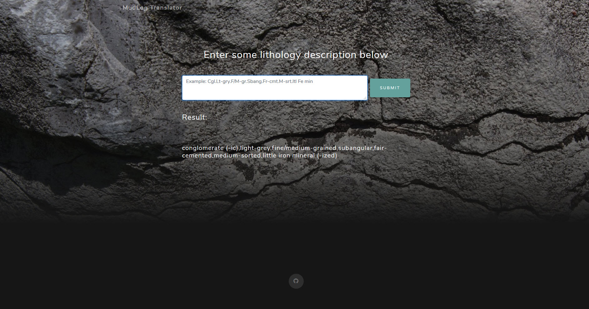

## MudLogTranslator
Translate abbreviated lithology short description. You can check the idea [here](https://events.agilescientific.com/idea/lithology-translator-for-cumbersome-geological-descriptions) and the dataset [here](http://shorturl.at/ltDI2). The webpage is using [Grayscale theme](https://startbootstrap.com/themes/grayscale/). It needs to improve the translation flexibility and feel free to give some feedback.

Issue:
There are some words that already in the dictionary but it does't translate correctly (i.e: Sst --> sandstone)

